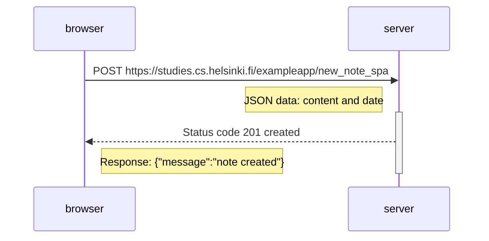

```mermaid
sequenceDiagram
    participant browser
    participant server

    browser->>server: POST https://studies.cs.helsinki.fi/exampleapp/new_note_spa
    Note left of server: JSON data: content and date
    activate server
    server-->>browser: Status code 201 created
    Note right of browser: Response: {"message":"note created"}
    deactivate server
```
